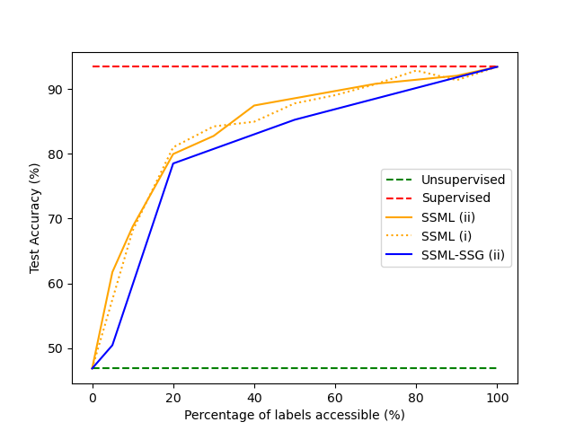
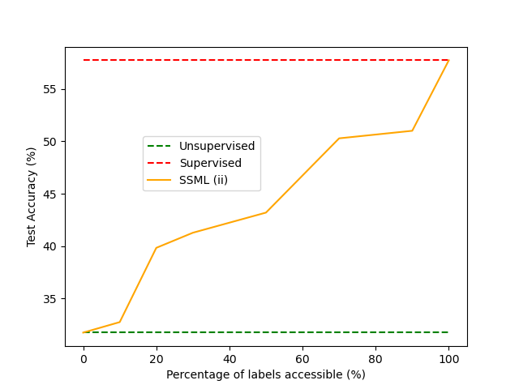

# Extending Unsupervised Meta-Learning with Latent-Space Interpolation in GANs to Semi-Supervised Meta-Learning

📄 **Stanford CS330 Final Project**  
👩‍💻 Helgi Hilmarsson, Davide Giovanardi, Arvind Kumar, William Steenbergen  
🎓 Stanford University – ICME  
🧑‍🏫 Mentor: Rafael Rafailov  

---

## 📌 Abstract
While supervised and unsupervised meta-learning techniques are widely researched, **semi-supervised approaches remain underexplored**.  
In this work, we extend **LASIUM** (Latent-Space Interpolation for Unsupervised Meta-Learning, Khodadadeh et al.) into a **semi-supervised framework**.  

We propose two methods:
- **SSML** (Semi-Supervised Meta-Learning): Concatenates labeled data with GAN-generated data for meta-training.  
- **SSML-SSG** (Semi-Supervised Meta-Learning with Semi-Supervised GAN): Uses labeled data both in meta-training and to improve GAN sample quality.  

We evaluate these on **Omniglot** and **Mini-ImageNet**, showing that adding labeled data improves performance on unseen tasks monotonically.  
Interestingly, **SSML outperforms SSML-SSG on Omniglot**, possibly because SS-GANs generate noisier samples.  

---

## 📖 Table of Contents
1. [Introduction](#-introduction)  
2. [Related Work](#-related-work)  
3. [Methods](#-methods)  
   - [SSML](#-semi-supervised-meta-learning-ssml)  
   - [SSML-SSG](#-semi-supervised-meta-learning-with-semi-supervised-generators-ssml-ssg)  
   - [Semi-Supervised Data Pipeline](#-semi-supervised-data-pipeline)  
   - [Architectural Details](#-architectural-details)  
4. [Experiments](#-experiments)  
   - [Datasets](#-datasets)  
   - [Experimental Details](#-experimental-details)  
5. [Results](#-results)  
6. [Conclusion](#-conclusion)  
7. [Discussion and Next Steps](#-discussion-and-next-steps)  
8. [Implementation](#-implementation-details-and-code)  
9. [Contributions](#-group-member-contributions)  

---

## 🚀 Introduction
Meta-learning algorithms aim to prepare models to quickly adapt to new tasks.  
We explore how **limited labeled data** can enhance unsupervised meta-learning, with applications in domains like medical imaging where labels are scarce.

---

## 📚 Related Work
- **CACTUs (Hsu et al.)**: Uses clustering to generate pseudo-labels.  
- **LASIUM (Khodadadeh et al.)**: Uses GAN/VAEs for latent space interpolation to build supervised tasks from unlabeled data.  
- **Semi-supervised GANs (Salimans et al.)**: Extend GAN discriminators with label prediction for better feature learning.  

---

## 🛠 Methods
### 🔹 Semi-Supervised Meta-Learning (SSML)
- Combines **labeled data** with GAN-generated tasks.  
- The meta-learner alternates updates between real and synthetic data.  

### 🔹 Semi-Supervised Meta-Learning with Semi-Supervised GAN (SSML-SSG)
- Extends GAN discriminator with label prediction.  
- Generator learns to produce **class-conditional images**.  

### 🔹 Semi-Supervised Data Pipeline
We simulate label availability with three schemes:
1. X% of instances labeled across all classes.  
2. 100% of instances labeled for X% of classes.  
3. Randomly label X% of the dataset.  

### 🔹 Architectural Details
- **Omniglot**: 3-layer convolutional GAN.  
- **Mini-ImageNet**: 5-block convolutional GAN (more compute-intensive).  
- Meta-learning via **MAML**.  

---

## 🧪 Experiments
### Datasets
- **Omniglot**: Handwritten characters (low intra-class variance).  
- **Mini-ImageNet**: Complex, diverse images (high intra- and inter-class variance).  

### Setup
- **1-shot, 5-way classification**.  
- GAN trained for **500 epochs on Omniglot** and **100 epochs on Mini-ImageNet**.  

---

## 📊 Results

### Omniglot (1-shot, 5-way classification)
- Both SSML and SSML-SSG improve over unsupervised LASIUM.  
- **SSML slightly outperforms SSML-SSG** under different label sampling strategies.  
- Suggests that adding labeled data consistently improves downstream performance.

  
*Figure 7: Performance on Omniglot using LASIUM-RO. Steep curve shows large performance gains even with limited labels.*

---

### Mini-ImageNet (1-shot, 5-way classification)
- Both methods show improvements as label percentage increases.  
- Performance curve is **more gradual** than Omniglot, reflecting greater dataset complexity.  
- Due to compute limits, only SSML was fully evaluated.

  
*Figure 8: Performance on Mini-ImageNet using LASIUM-N. Gradual improvement curve reflects dataset diversity.*

---

### GAN vs SS-GAN Outputs
- Regular GAN produces visually richer Omniglot samples.  
- SS-GAN samples contain more noise and simpler strokes, possibly explaining lower performance.  

---

## ✅ Conclusion
- Semi-supervised extensions improve over unsupervised LASIUM.  
- **SSML outperforms SSML-SSG** on Omniglot due to better-quality synthetic tasks.  
- Provides guidance on how much labeled data is worth annotating before resources are spent.  

---

## 💡 Discussion & Next Steps
- Improve GAN training with **architecture optimization and feature matching**.  
- Explore SS-GAN on **Mini-ImageNet**, where noise may align better with natural class variance.  
- Extend to other meta-learners (e.g., ProtoNets) and other unsupervised methods (e.g., DeepCluster).  

---
📌 *This work was conducted as part of Stanford CS330: Deep Multi-Task and Meta Learning.*
